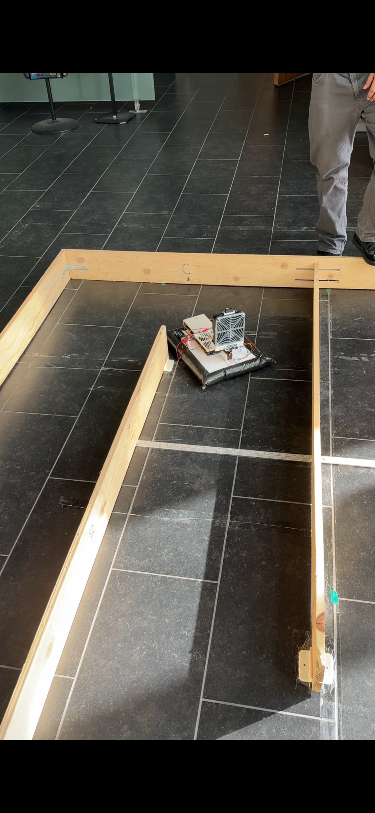
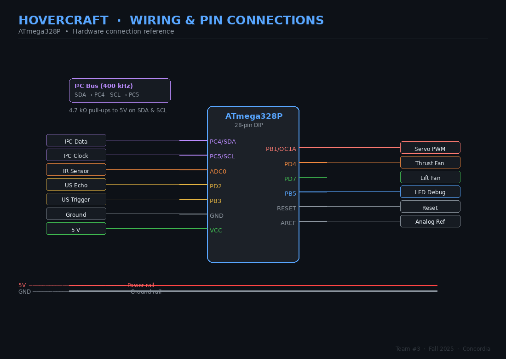

# Autonomous Maze-Navigating Hovercraft

Engineered a bare-metal robotics system in C (ATmega328P), integrating MPU-6050 IMU data and PID yaw control to achieve autonomous physical maze navigation.

---

## 🎥 Demo

### Model Simulation


### Maze Run


<table width="100%">
  <tr>
    <th width="50%">Maze Photo</th>
    <th width="50%">Demo Video</th>
  </tr>
  <tr>
    <td valign="top" align="center" style="height: 700px;">
      
    </td>
    <td valign="top" align="center" style="height: 700px;">
      <video
        src="https://github.com/user-attachments/assets/57c69494-b7ab-4d8a-a9e7-fc51435025ab"
        controls
        style="height: 100%; width: 100%; object-fit: fill;">
      </video>
    </td>
  </tr>
</table>

## Team 🤖
- Chrisjan Alejandro  
- Juan Sebastian Holguin Corpas  
- Mcwill Buikpor  
- Niraj Patel  
- Philippe Hadley Plancher

---

## 🚀 Highlights

- **Engineered bare-metal AVR firmware** utilizing direct register manipulation, completely bypassing Arduino HALs for optimized performance.
- **Implemented a real-time PID control system** to maintain precise heading stability using MPU-6050 gyroscope data.
- **Designed a comprehensive sensor fusion architecture**, interfacing IR, ultrasonic, and IMU sensors via $I^2C$ for robust environmental perception.
- **Developed state-machine-based autonomous navigation algorithms** to handle complex intersection logic, dead-end recovery, and end-state detection.
- **Programmed custom software PWM** leveraging Timer0 Interrupt Service Routines (ISRs) to drive independent dual-fan actuation.
- **Executed end-to-end mechatronic system design**, bridging hardware integration, embedded C firmware, control theory, and physical validation testing.

---

## Overview

An autonomous, maze-solving hovercraft governed by an ATmega328P running custom bare-metal C. It features a custom sensor fusion suite (gyroscope, IR, ultrasonic) and real-time PID yaw control to seamlessly manage lift, vectored thrust, and dynamic pathfinding without relying on external libraries or an RTOS.

---

## Context
Built as part of an engineering project at Concordia University.

---

## Key Features

- **Closed-Loop Heading Control:** Maintains linear trajectory via a PID control loop, utilizing integrated MPU-6050 yaw telemetry to dynamically correct heading drift.
- **Filtered Obstacle Detection**: Triggers braking and state transitions using noise-filtered, moving-average readings from Sharp GP2Y IR sensors.
- **Heuristic Pathfinding**: Executes a greedy navigation algorithm via servo-swept environmental scanning, autonomously vectoring toward the path of maximum clearance.
- **Automated Dead-End Resolution**: Detects dual-sided lateral occlusions and initiates a calculated 180° U-turn maneuver to resume continuous navigation.
- **Robust End-State Validation**: Confirms mission completion using multi-sample verification from an HC-SR04 ultrasonic sensor to detect overhead structures before executing a system halt.
- **Interrupt-Driven Actuation**: Enables independent dual-fan modulation via a custom 1 kHz software PWM, leveraged entirely through Timer0 Interrupt Service Routines (ISRs).
- **Low-Level Firmware Architecture**: Developed purely in bare-metal AVR C via direct hardware register manipulation, bypassing high-level abstraction layers.

---

## Hardware

| Component | Purpose |
|---|---|
| ATmega328P @ 16 MHz | Main microcontroller |
| MPU-6050 (I2C / TWI) | Gyroscope for yaw tracking and heading lock |
| Sharp GP2Y IR sensor | Front wall and obstacle distance measurement |
| HC-SR04 ultrasonic sensor | Upward-facing finish-bar detection |
| Hobby servo (PWM) | Thrust vectoring by deflecting airflow |
| Brushless lift fan | Generates air cushion to float the craft |
| Brushless thrust fan | Forward propulsion |
| LiPo battery pack | Onboard power supply |
| Foam board + plastic sheet | Hovercraft skirt and chassis |

---

## Software Architecture

```text
Hovercraft-Project/
├── README.md
├── .gitignore            Ignore AVR build outputs
├── Makefile              avr-gcc build and avrdude flash targets
├── config.h              All pin definitions, thresholds, and tuning constants
├── legacy/
│   └── FinalHovercraftCode_290_TEAM3_FALL_2025.c
│                         Archived competition submission source
├── Parts_&_Calculations.xlsx
│                         Bill of materials and design calculations
├── src/
│   ├── main.c            Entry point, 1 kHz systick ISR, software PWM, millis()
│   ├── imu.c             TWI driver, MPU-6050 init, gyro calibration, yaw integration
│   ├── sensors.c         ADC, IR distance sensor, HC-SR04 ultrasonic + upbar logic
│   ├── pid.c             PID yaw controller with anti-windup and filtered derivative
│   └── motion.c          Servo & fan control, turning, straight drive, intersection solver
├── include/
│   ├── imu.h
│   ├── sensors.h
│   ├── pid.h
│   ├── motion.h
│   └── system.h
```
All tunable parameters (PID gains, thresholds, pin assignments, duty cycles) live in `config.h` so nothing is buried in logic files.

---

## Repository Notes

- `legacy/FinalHovercraftCode_290_TEAM3_FALL_2025.c` is preserved as an archival snapshot of the final competition source.
- Build artifacts (`*.o`, `*.elf`, `*.hex`) are intentionally ignored via `.gitignore` to keep the repository clean.

---

## Navigation & Control Logic

```text
┌─────────────────────────────────────┐
│      drive_straight_until_wall()   │
│  - Lock yaw reference               │
│  - PID corrects servo every loop    │
│  - Check IR every 60 ms             │
│  - Check upbar → finish_stop()      │
└────────────┬────────────────────────┘
             │ IR ≤ OBSTACLE_THRESHOLD_CM
             ▼
┌─────────────────────────────────────┐
│         handle_intersection()       │
│  - Servo sweeps left → IR reading   │
│  - Servo sweeps right → IR reading  │
│  - Both blocked? → U-turn 180°      │
│  - Else → turn toward open side     │
└─────────────────────────────────────┘
```

**PID heading lock** — `servo_from_yaw_error()` runs every main-loop iteration during straight driving. The derivative term is low-pass filtered (`YAW_D_LPF_ALPHA = 0.7`) to reduce servo jitter from noisy gyro data. Integral windup is clamped to ±`YAW_I_MAX`.

**Turn execution** — `turn_by_yaw()` resets the yaw accumulator to zero, commands the servo hard left or right, and runs the thrust fan until integrated angle reaches target (±5° tolerance) or a 3-second timeout.

**Key tuning constants (`config.h`):**

| Constant | Default | Description |
|---|---|---|
| `YAW_KP / YAW_KI / YAW_KD` | 3.0 / 0.1 / 0.8 | PID gains for heading correction |
| `OBSTACLE_THRESHOLD_CM` | 60 cm | Stop distance from front wall |
| `THRUST_CRUISE_DUTY` | 80% | Fan duty during straight driving |
| `UPBAR_THRESHOLD_CM` | 25 cm | Max distance to detect finish bar |
| `UPBAR_CONFIRM_COUNT` | 3 | Consecutive reads required to confirm bar |

---

## Hardware Connections

| Pin | Connection | Notes |
|---|---|---|
| `PB1` (OC1A) | Servo | Timer1 hardware PWM, 50 Hz, 600–2400 µs pulse |
| `PD4` | Thrust fan | Software PWM via Timer0 ISR |
| `PD7` | Lift fan | Software PWM via Timer0 ISR |
| `PB3` | Ultrasonic trigger | 10 µs pulse output |
| `PD2` | Ultrasonic echo | Pulse-width input, measured in µs |
| `ADC0` (PC0) | IR sensor | Analog voltage to distance via curve fit |
| `PC4` (SDA) | MPU-6050 data | I²C data line |
| `PC5` (SCL) | MPU-6050 clock | I²C clock line |
| `PB5` | Debug LED | Blinks on finish |

> **Power note:** MCU logic runs at 5V. Fans should be driven through MOSFET/ESC stages at battery voltage.

---

## How to Build and Flash

**Requirements:** `avr-gcc`, `avr-libc`, `avr-binutils`, `avrdude`

```bash
# Clone the repo
git clone https://github.com/Alertify123/Hovercraft-Project.git
cd hovercraft

# Compile
make

# Flash via Arduino bootloader (adjust port as needed)
make flash

# Clean build artifacts
make clean
```

Default upload port is `/dev/ttyUSB0`. Edit `PORT` in the `Makefile` if needed.

---

## Future Improvements

- Replace greedy intersection solver with a loop-safe maze algorithm (left-hand-rule / flood-fill)
- Add side-wall sensors for corridor centering
- Add IMU fusion to reduce long-run yaw drift
- Add closed-loop fan control (RPM/current feedback)
- Add wireless telemetry for tuning and debugging
- Improve skirt design for lower leakage and better turning precision
---

